# 图书数据库管理系统
## 实验平台 
- 开发平台: Ubuntu 16.04 LTS
- 开发语言: java
- 依赖数据库: MySQL
- 图形界面: SWT
- 依赖包： JDBC, java-json

## 实验内容和要求
1. 设计简单的图书管理数据库概念模式
2. 设计相应的关系模式
3. 基于 ODBS 或 JDBC 实现一个图书管理程序,实现图书、借书证及图书借阅的
管理的基本功能

## 总体设计
### 数据库结构设计
共设计6个表格

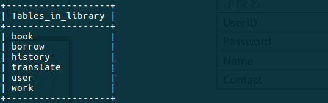
***
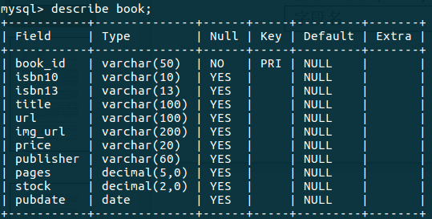
***
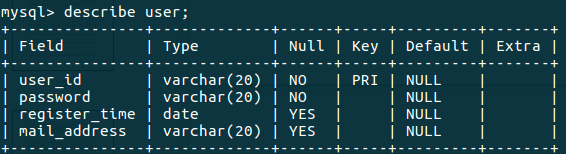
***
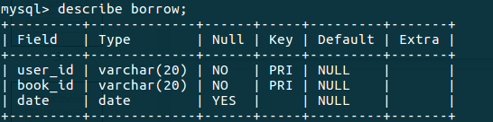
***
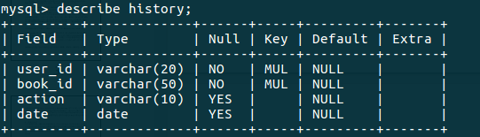

action指借借阅行为, 包括borrow, return, renew
***
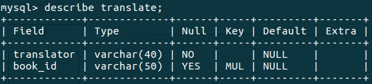
***
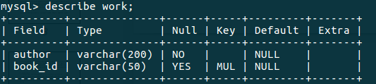
***
程序借还书主要插入记录到history表格中,由触发器info_update执行图书库存, borrow表格的更新, 触发器info_update设计代码如下:
```mysql
DROP TRIGGER info_update;
CREATE TRIGGER info_update
AFTER INSERT ON history
FOR EACH ROW
  BEGIN
    UPDATE book
    SET stock =
      CASE
      WHEN new.action = "borrow"
        THEN stock - 1
      WHEN new.action = "return"
        THEN stock + 1
      WHEN new.action = "renew"
        THEN stock
      END
    WHERE book.book_id = new.book_id;
    IF new.action = "borrow"
    THEN INSERT INTO borrow VALUE (new.user_id, new.book_id, new.date);
    ELSEIF new.action = "return"
      THEN
        DELETE FROM borrow
        WHERE borrow.user_id = new.user_id AND borrow.book_id = new.book_id;
    END IF;
  END;
```

### 系统架构设计
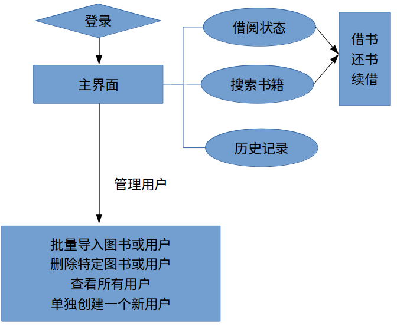
***
菜单结构

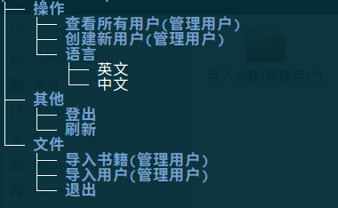

***
功能列表:

- 图书查询.标题或作者模糊查询,图书编号, isbn等关系"与"和"或"查询.
- 基本借书,还书,续借功能
- 查看借阅历史
- 切换中英文语言
- 批量导入用户或图书(管理用户)
- 单独创建用户,从数据库删除用户,删除书籍(管理用户)
- 查看当前数据库所有用户(管理用户)
***
### 所用开发技术
所有开发技术总体可以分为MySQL, JDBC, java-SWT和java-json

1.MySQL

本实验采用MySQL作为关系数据库管理系统(DBMS)。

MySQL 是瑞典的MySQL AB公司开发的一个可用于各种流行操作系统平台的关系数据库系统，它具有客户机/服务器体系结构的分布式数据库管理系统。MySQL 完全适用于网络，用其建造的数据库可在因特网上的任何地方访问，因此，可以和网络上任何地方的任何人共享数据库。MySQL具有功能强、使用简单、管理方便、运行速度快、可靠性高、安全保密性强等优点。MySQL用C和C++编写，它可以工作在许多平台（Unix，Linux，Windows）上，提供了针对不同编程语言(C,C++,JAVA等)的API函数；使用核心线程实现多线程，能够很好的支持多CPU；提供事务和非事务的存储机制；快速的基于线程的内存分配系统；MySQL采用双重许可，用户可以在GNU许可条款下以免费软件或开放源码软件的方式使用MySQL软件，也可以从MySQL AB公司获得正式的商业许可。


2.JDBC

本实验通过JDBC使java程序访问MySQL数据库管理系统。

Java数据库连接，（Java Database Connectivity，简称JDBC）是Java语言中用来规范客户端程序如何来访问数据库的应用程序接口，提供了诸如查询和更新数据库中数据的方法。JDBC也是Sun Microsystems的商标[1]。JDBC是面向关系型数据库的。
在J2SE中，提供了一个称之为JDBC-ODBC桥（JDBC-ODBC Bridge[2]）的API。通过ODBC，JDBC-ODBC桥驱动程序可以访问所有支持ODBC的关系型数据库。

3.java下SWT包和json包

本实验使用SWT来构建图形界面,使用json格式文件保存批量导入图书或用户的数据。

SWT(Standard Widget Toolkit) Standard Widget Toolkit是一个开源的GUI编程框架，与AWT/Swing有相似的用处，著名的开源IDE-eclipse就是用SWT开发的。 在SWT之前，Sun已经提供了一个跨平台GUI开发工具包AWT (Abstract Windowing Toolkit).AWT框架底层使用原生窗口部件(native widgets)构建，只能使用各个平台窗口部件的子集。

JSON（JavaScript Object Notation）是一种由道格拉斯·克罗克福特构想设计、轻量级的资料交换语言，以文字为基础，且易于让人阅读。尽管JSON是Javascript的一个子集，但JSON是独立于语言的文本格式，并且采用了类似于C语言家族的一些习惯。

## 详细介绍

### 登录界面
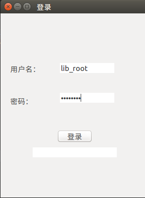

密码错误或者没有会提示登录失败


### 主界面-- 还书,续借

登录成功后会主界面会显示当前用户已经借过但未还的书,其中背景色为红色表示该用户逾期(超过30天)未还的书

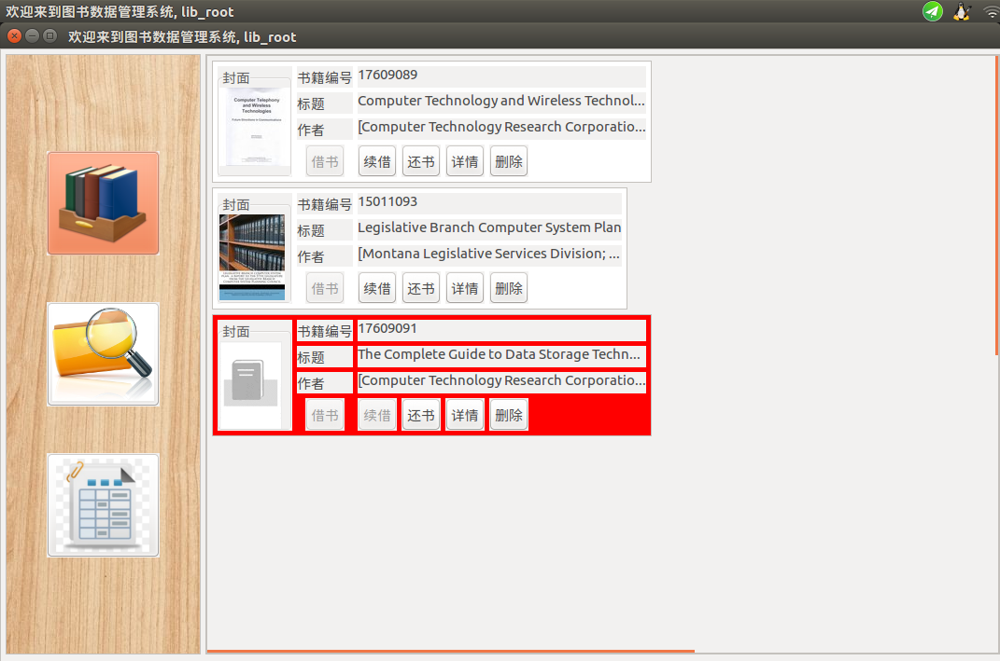

每本书有借书, 续借, 还书, 详情和删除选项, 对于已经借的书不能再借, 借书按钮设为失效, 逾期没还的书也不能续借, 删除按钮只有管理用户才能执行.
***
续借成功会显示

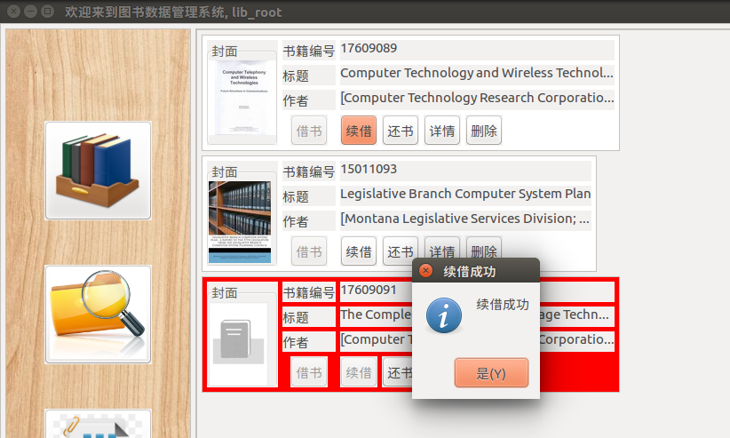

执行主要代码会更新借书记录时间到当前日期

```java
public class SQLConnection{
    private final static String renewBook =
            "UPDATE borrow " +
            "SET date = CURRENT_DATE " +
            "WHERE book_id = ? AND user_id = ?";
    public void renewBook(String bookId) throws SQLException{
        renewBookStat.setString(1, bookId);
        renewBookStat.setString(2, userName);
        System.out.println(renewBookStat);
        renewBookStat.execute();
    }
}
```
***
还书成功显示

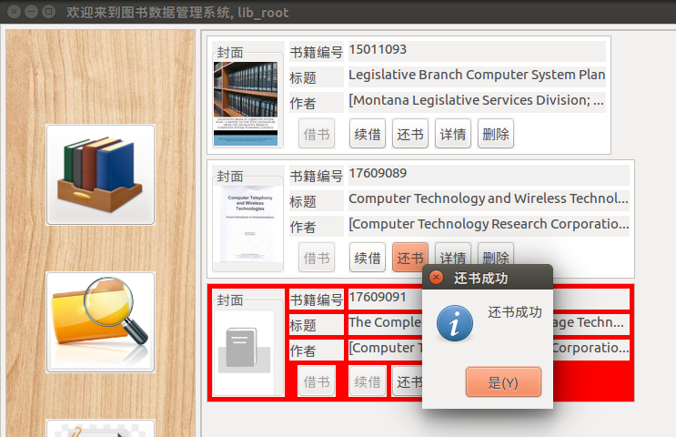

执行主要代码会, 向表格history中插入还书记录,此后有前面提到的触发器info_update自动更新库存和borrow表格

```java
public class SQLConnection{
    private final static String insertHistoryAction =
            "INSERT INTO history " +
            "VALUE (?, ?, ?, CURRENT_DATE )";
    public void returnBook(Book book) throws SQLException {
        insertHistoryStat.setString(1, userName);
        insertHistoryStat.setString(2, book.id);
        insertHistoryStat.setString(3, "return");
        insertHistoryStat.execute();
    }
}
```
***
点击详情可以查看该图书的详细信息和借书日期

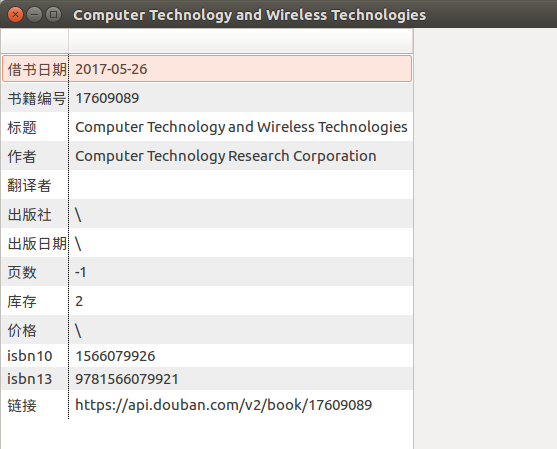

### 搜索界面
搜索界面可以根据图书名称(模糊查找), 作者(模糊查找), 书籍编号, isbn10, isbn13, 库存容量(大于某个值)查找. 最多支持3个上述变量的"与"和"或"关系查找, 另外也可以选择只筛选库存有余量的书. 搜索结果里面背景为红色表示该图书用户已经在借.

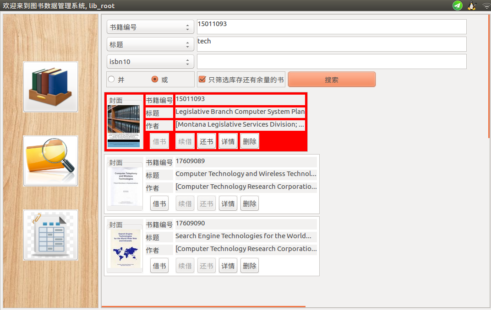

实现上对于图书名称(模糊查找), 作者(模糊查找), 书籍编号, isbn10, isbn13, 库存容量(大于某个值)的关系筛选直接体现在SQL搜索语句上,而对于"只筛选库存有余量的书"功能则在前面搜索基础上java程序去掉库存没有余量的书

如果用户自提供了图书名称, 作者, 书籍编号, isbn10, isbn13, 库存容量中的一个选项, 直接执行单个筛选, 以图书名称代码为例:
```java
public class SQLConnection{
    private final static String bookTitleQuery =
            "SELECT book_id " +
            "FROM book " +
            "WHERE title REGEXP ? ";
    public Book[] selectTitleBook(String title) throws SQLException {
        bookTitleStat.setString(1, ".*" + title.trim() + ".*");
        System.out.println(bookTitleStat.toString());
        ResultSet resultSet = bookTitleStat.executeQuery();
        ArrayList<Book> bookList = new ArrayList<>();
        while (resultSet.next()) {
            bookList.add(getBook(resultSet.getString(1)));
            resultSet.next();
        }
        return bookList.toArray(new Book[0]);
    }
}
```
如果用户在图书名称, 作者, 书籍编号, isbn10, isbn13, 库存容量中提供了2个以上的选项, 会进行关系的符合筛选,具体代码为:
```java
public class SQLConnection{
    private final static String bookMultiQuery =
            "SELECT DISTINCT book_id " +
            "FROM book NATURAL JOIN work " +
            "WHERE ";
    public Book[] selectMultiBook(HashMap<String, String> querySet, boolean isAnd) throws SQLException{
        StringBuilder query = new StringBuilder(bookMultiQuery);
        boolean isFirst = true;
        String logic = isAnd ? " AND " : " OR ";
        for(Map.Entry<String, String> entry : querySet.entrySet()){
            if(isFirst){
                isFirst = false;
            }else{
                query.append(logic);
            }
            if(entry.getKey().equals("title") || entry.getKey().equals("author")){
                query.append(entry.getKey());
                query.append(" REGEXP ");
                query.append("\".*" + entry.getValue() + ".*\"");
            }else{
                query.append(entry.getKey());
                if(entry.getKey().equals("stock"))
                    query.append(">=");
                else
                    query.append("=");
                query.append("\"" + entry.getValue() + "\"");
            }
        }
        System.out.println(query);
        ResultSet resultSet = stat.executeQuery(query.toString());
        ArrayList<Book> bookList = new ArrayList<>();
        while (resultSet.next()) {
            Book book = getBook(resultSet.getString(1));
            bookList.add(book);
        }
        return bookList.toArray(new Book[0]);
    }
}
```
***
点击详情按钮可以查看图书详细信息, 结果和在主界面点击详情时相同.点击借书按钮如果借书成功会弹出提示窗口

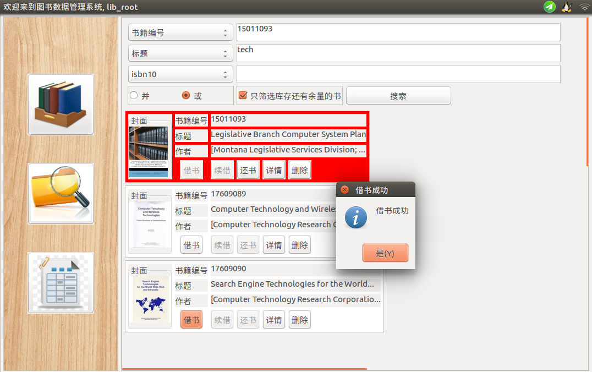

执行主要代码会, 向表格history中插入借书记录,此后有前面提到的触发器info_update自动更新库存和borrow表格

```java
public class SQLConnection{
    public void borrowBook(Book book) throws SQLException {
        insertHistoryStat.setString(1, userName);
        insertHistoryStat.setString(2, book.id);
        insertHistoryStat.setString(3, "borrow");
        return insertHistoryStat.execute();
    }
}
```

### 历史操作界面
这部分比较简单,会直接显示过去借书和还书的记录, 借书记录背景为黄色, 还书记录背景为绿色

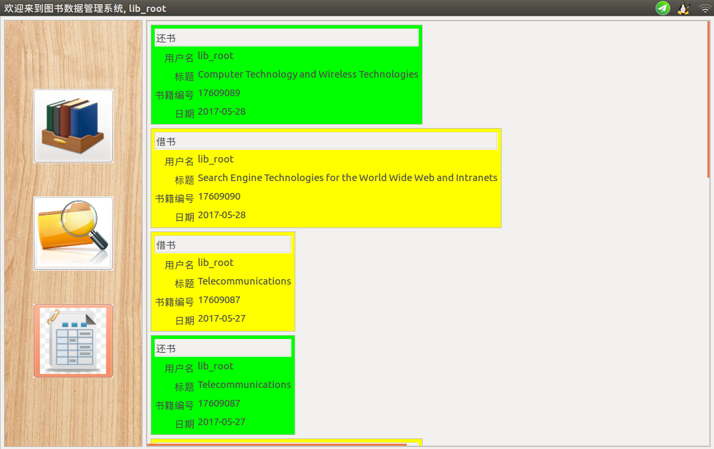

主要代码从history表格中搜索当前用户的记录, 按照时间顺序降序返回

```java
public class SQLConnection{
    private final static String historyQuery =
            "SELECT book_id, action, date " +
            "FROM history " +
            "WHERE user_id = ? " +
            "ORDER BY date DESC";
    public History[] selectHistory(String user_id) throws SQLException {
        historyStat.setString(1, user_id);
        System.out.println(historyStat);
        ResultSet resultSet = historyStat.executeQuery();
    
        ArrayList<History> historyList = new ArrayList<>();
        while (resultSet.next()) {
            String book_id = resultSet.getString(1);
            String action = resultSet.getString(2);
    
            History history = new History();
            history.user_id = user_id;
            history.action = Enum.valueOf(Action.class, action.toUpperCase());
            history.date = resultSet.getString(3);
            history.book = getBook(book_id);
            historyList.add(history);
        }
        return historyList.toArray(new History[0]);
    }
}
```
### 管理功能

#### 批量导入图书
本系统设计时图书初始化是通过豆瓣开发者服务提供的基于豆瓣各产品、面向开发者的开放接口（API）服务导入图书信息, 豆瓣开发API可见[豆瓣开发者服务](https://developers.douban.com/), 直接抓取的图书数据格式为json格式, 对于图书封面图片只保存链接, 然后在展示图书交互界面时再实时从豆瓣服务器上直接下载图片. 所以后来由管理用户批量导入数据时也沿用了豆瓣APi返回数据格式,下面是一个批量导入的图书数据格式:
```json
{
  "books": [
    {
      "publisher": "Addison-Wesley (C)",
      "isbn10": "0201177536",
      "pubdate": "1987-11",
      "author": [
        "Inc. Apple Computer"
      ],
      "url": "https:\/\/api.douban.com\/v2\/book\/3631762",
      "isbn13": "9780201177534",
      "price": "USD 14.95",
      "title": "Apple Human Interface Guidelines",
      "pages": "162",
      "translator": [],
      "images": "https://img1.doubanio.com\/spic\/s4548699.jpg",
      "summary": "",
      "id": "3631762",
      "stock":10
    }
  ]
}
```

操作: 文件->导入书籍->选择文件->确定

#### 批量导入用户和权限管理
批量导入用户的用户数据格式同样采用json格式, 下面是一个导入用户数据文件的例子:

```json
{
  "users": [
    {
      "id": "bai5",
      "password": "123",
      "date": "2000-01-01",
      "mail": "baislsl@163.com"
    },
    {
      "id": "bai6",
      "password": "45678",
      "date": "1000-01-01",
      "mail": "gg@gmail.com"
    }
  ]
}
```

操作: 文件->导入用户->选择文件->确定

也可以单独创建一个用户, 操作: 操作->创建新用户->输入信息, 界面如下:

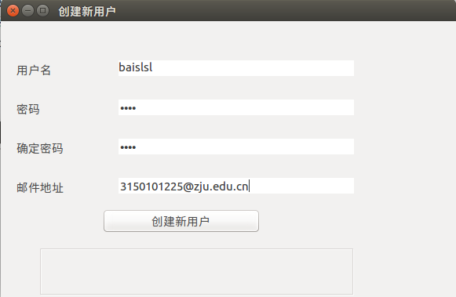

对于每个新用户,会在数据库中创建一个新的用户, 同时记录其信息到user表格中,考虑到安全因素, 管理用户唯一设计为lib_root, 对数据库library下所有表格赋予所有权限. 普通用户只能查看book, translate, work等表格, 可以查看并插入history和borrow, 对user表格不具访问权限,创建新用户时对其赋予权限代码如下:

```java
public class SQLConnection{
    private final static String[] grantAction = {
            "GRANT SELECT, INSERT, DELETE ON library.borrow TO ?",
            "GRANT SELECT, INSERT ON library.history TO ?",
            "GRANT SELECT ON library.book TO ?",
            "GRANT SELECT ON library.translate TO ?",
            "GRANT SELECT ON library.work TO ?"
    };
}
```


#### 查看并删除用户

操作: 操作->查看所有用户->选中要删除的用户->点击删除确认

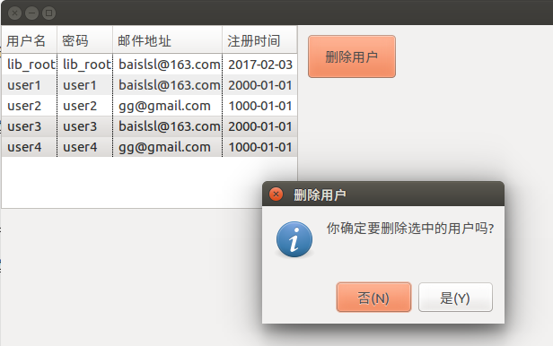

#### 中英文语言切换

操作: 操作->语言->中文/英文->重启

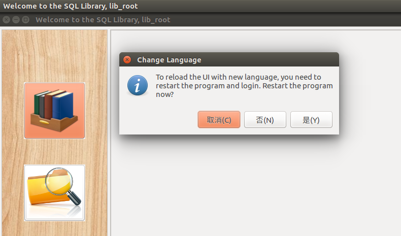

## 实验心得

本次实验完成一个图书管理系统, 是我对MySQL各种操作, JDBC, SWT都有了更深的学习和理解. 


